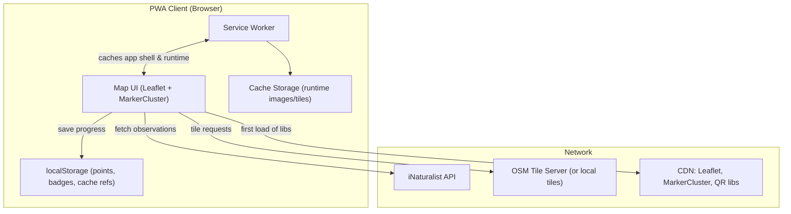

# Garden Tour PWA – ERC Vale da Lama

A fully responsive, offline-capable **Progressive Web App** (PWA) that loads **live observations** from the iNaturalist project **ERC Vale da Lama**, shows them on a Leaflet map with **marker clustering**, and supports **QR deep-links** that open a plant’s popup on load. Includes a **gamification layer** (points + badges, locally persisted) and a **QR code generator** page for printing signpost codes.

---

## Live Data Source
- iNaturalist project: https://www.inaturalist.org/projects/erc-vale-da-lama
- Public API endpoint used:
  ```
  https://api.inaturalist.org/v1/observations?project_id=erc-vale-da-lama&per_page=200&order=desc&order_by=created_at
  ```

---

## Features
- 📍 Leaflet map with **MarkerCluster** to avoid overlapping pins
- 🗺️ **Bounds-restricted** to the garden area (edit in `app.js`)
- 🔗 **QR deep-link** support: `?id=<observation_id>` opens that plant’s popup
- 🧭 **Responsive UI** (mobile/desktop)
- 📦 **Offline** with Service Worker (caches app shell, libs, last data, images)
- 🏅 **Gamification**: points + badges persisted in localStorage
- ♻️ **Reset My Tour** to clear progress
- 🧾 **QR Admin** page to generate printable QR codes (offline-capable)

---

## Quick Start (GitHub Pages)
1. Put this `docs/` folder in your repo at the root (e.g., `ludwa6/garden_tour/docs/`).
2. In GitHub → **Settings** → **Pages**:
   - Source: Branch = `main`
   - Folder = `/docs`
3. Open your Pages URL: `https://<user>.github.io/<repo>/`
4. On mobile, use **Add to Home Screen** to install the PWA.

> First load requires Internet to cache libraries and assets. After that, it works offline with the **last fetched dataset** and cached tiles/photos.

---

## Configure Garden Bounds
Edit `docs/app.js` and update `GARDEN_BOUNDS` to your exact rectangle (SW, NE corners):
```js
const GARDEN_BOUNDS = L.latLngBounds(
  [37.1210, -8.6600], // south-west (approximate)
  [37.1300, -8.6400]  // north-east (approximate)
);
```
If you provide the precise polygon or bbox, we can set it for you.

---

## QR Deep-Links
Generate a QR that encodes a URL like:
```
https://ludwa6.github.io/garden_tour/?id=123456
```
When the PWA loads and finds `id=123456`, it fetches the observations, locates that one, and **opens its popup** without re-centering the map (to avoid jarring jumps).

Use **`qr_admin.html`** to create these codes easily.

---

## Gamification
- **Points**
  - +10 for scanning a QR (arriving with `?id=`)
  - +2 for opening any observation popup
  - +1 bonus for viewing 5 new species in a session
- **Badges**
  - 🌱 *Seed* — First visit
  - 🌿 *Bud* — First QR scan
  - 🌸 *Flower* — 5 plants viewed
  - 🐝 *Pollinator* — 10 plants viewed
  - 🌳 *Forest Guardian* — Visit all key areas (stub toggle you can use later)
- **Reset My Tour** clears all progress (points, badges, visited IDs)

All data is stored locally (no accounts required).

---

## Architecture
See below for the Mermaid diagram. The raw file is also saved as `architecture.mmd` for editing.



---

## Files
```
docs/
├── index.html
├── app.js
├── style.css
├── manifest.json
├── service-worker.js
├── qr_admin.html
├── architecture.mmd
├── images/
│   └── icons/
│       ├── icon-192.png   (replace)
│       └── icon-512.png   (replace)
└── js/
    ├── leaflet.js         (CDN via unpkg at runtime; cached by SW)
    ├── leaflet.css        (from CDN)
    └── markercluster libs (from CDN)
```

---

## Notes
- For 100% offline base map tiles, pre-generate a small tile set for the garden and serve from `/docs/tiles/{z}/{x}/{y}.png` — then change the tile URL in `app.js` and add those files to the `APP_SHELL` list in `service-worker.js`.
- Respect OSM tile usage policies if you rely on the public server in production.

---

## License
MIT
