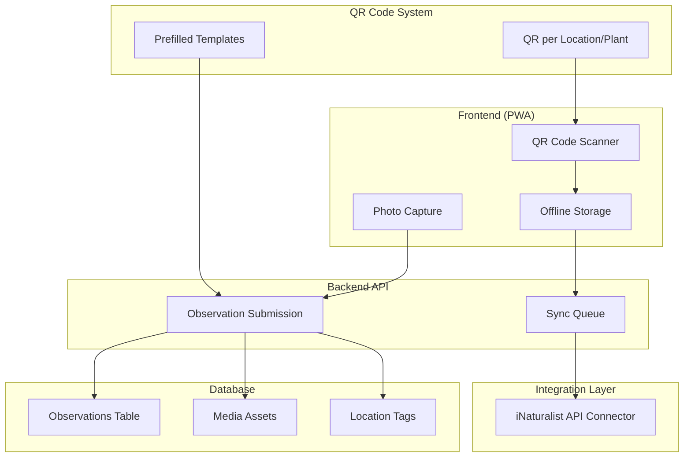

# BioBlitz App Architecture — Mermaid Diagram

```mermaid
flowchart TB
    subgraph Frontend["Frontend (PWA)"]
        A[Photo Capture]
        B[QR Code Scanner]
        C[Offline Storage]
    end

    subgraph Backend["Backend API"]
        D[Observation Submission]
        E[Sync Queue]
    end

    subgraph Integration["Integration Layer"]
        F[iNaturalist API Connector]
    end

    subgraph Database["Database"]
        G[Observations Table]
        H[Media Assets]
        I[Location Tags]
    end

    subgraph QR["QR Code System"]
        J[QR per Location/Plant]
        K[Prefilled Templates]
    end

    A --> D
    B --> C
    C --> E
    D --> G
    D --> H
    D --> I
    E --> F
    J --> B
    K --> D
```
